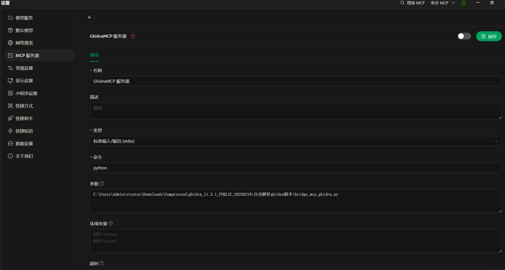

# Ghidra逆向
## 基于GhidraMcp的快速逆向脚本
使用qwen7b的高速处理性，批量进行函数重命名。再导出文件便于ai解析。
逆向重写推荐cursor，记得给cursor配置MCP服务。
### 项目要求：python>3.10


### Ghidra下载：https://github.com/NationalSecurityAgency/ghidra
### JDK21+下载：https://www.oracle.com/java/technologies/javase/jdk21-archive-downloads.html
### GhidraMCP配置：
https://github.com/user-attachments/assets/75f0c176-6da1-48dc-ad96-c182eb4648c3


# 使用说明
填入自己的硅基流动密钥，然后运行[ai_先运行仅重命名.py](%E8%84%9A%E6%9C%AC/ai_%E5%85%88%E8%BF%90%E8%A1%8C%E4%BB%85%E9%87%8D%E5%91%BD%E5%90%8D.py)
等待所有的FUN_xxxx函数重命名结束后，再运行[ai_再运行文件保存.py](%E8%84%9A%E6%9C%AC/ai_%E5%86%8D%E8%BF%90%E8%A1%8C%E6%96%87%E4%BB%B6%E4%BF%9D%E5%AD%98.py)
然后配置樱桃或者cursor的MCP进行分析即可。

MCP配置中用到的python路径填已经装了依赖的路径，另一个填[bridge_mcp_ghidra.py](%E8%84%9A%E6%9C%AC/bridge_mcp_ghidra.py)
的路径。
# 樱桃配置


# Cursor配置：
```json
{
  "mcpServers": {
    "V8Xm8V7ViUQC832L0yAcu": {
      "name": "GhidraMcp",
      "type": "stdio",
      "description": "",
      "isActive": true,
      "command": "C:\\Users\\Administrator\\AppData\\Local\\Programs\\Python\\Python313\\python.exe",
      "args": [
        "C:\\Users\\Administrator\\Downloads\\Compressed\\ghidra_11.3.1_PUBLIC_20250219\\bridge_mcp_ghidra.py"
      ]
    }
  }
}

```
# 小工具
[一键更换国内镜像源.exe](%E5%B7%A5%E5%85%B7/%E4%B8%80%E9%94%AE%E6%9B%B4%E6%8D%A2%E5%9B%BD%E5%86%85%E9%95%9C%E5%83%8F%E6%BA%90.exe)

# 需要远程协助配置请发送邮件到：
```text
666888@guanyue.fun
```
